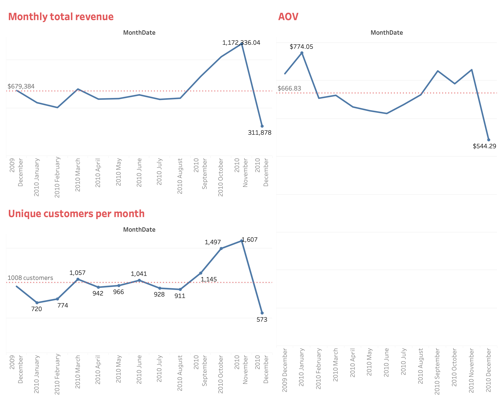
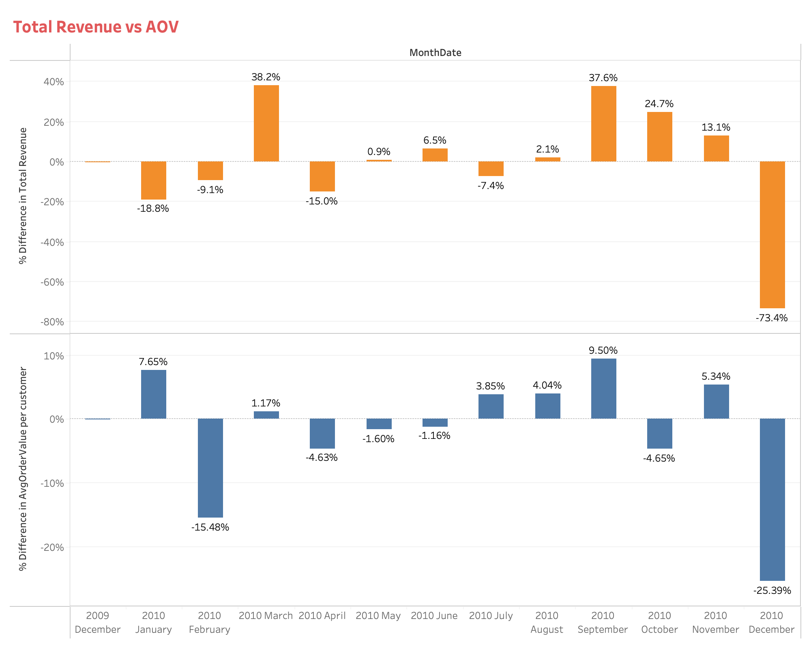
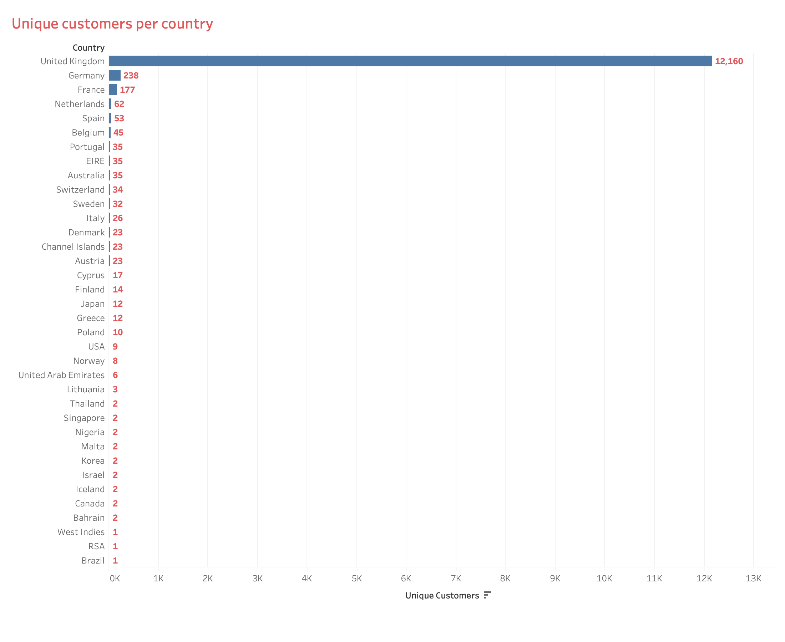

# Online Retail Business Intelligence Case Study

## Project Title
**Comprehensive Business Analytics for UK-Based Online Retail Operations (December 2009 - December 2010)**

---

## Business Context

This case study examines a UK-based, registered non-store online retailer specializing in unique all-occasion giftware. The company operates primarily in the B2B wholesale segment with an international customer base.

**Company Profile:**
- **Industry:** E-commerce Retail (Giftware)
- **Business Model:** Online-only, non-store retail
- **Primary Market:** United Kingdom
- **Customer Segment:** Predominantly wholesale buyers
- **Product Category:** Unique all-occasion gift items
- **Analysis Period:** December 1, 2009 – December 31, 2010 (13 months)

**Business Challenge:**  
Understanding extreme revenue volatility, customer purchasing patterns, and geographic market performance to inform strategic decision-making and identify sustainable growth opportunities.

---

## Objective

This analysis delivers actionable business intelligence across four critical dimensions:

1. **Revenue Analytics** - Identify monthly trends, seasonal patterns, and growth anomalies
2. **Customer Intelligence** - Analyze acquisition, retention, and purchasing behavior patterns
3. **Product Performance** - Identify top/underperforming products and optimize inventory
4. **Strategic Insights** - Provide data-driven recommendations for sustainable growth

---

## Dataset Overview

**Source:** Online Retail II Dataset  
**Total Transactions:** 525,461 records  
**Unique Customers:** 4,372 customers  
**Geographic Coverage:** 38+ countries  
**Product SKUs:** 3,684+ unique items

**Key Variables:**
- **InvoiceNo:** Transaction identifier (6-digit; 'C' prefix = cancellation)
- **StockCode:** Product/SKU identifier
- **Description:** Product name
- **Quantity:** Units per transaction
- **InvoiceDate:** Transaction timestamp
- **UnitPrice:** Price per unit (GBP £)
- **CustomerID:** Unique customer identifier
- **Country:** Customer location

---

## Data Preparation

### Phase 1: Data Cleaning & Quality Assurance

**Issues Addressed:**
- Missing CustomerID values: 135,080 records (25.7%)
- Negative quantities (returns/cancellations)
- Invalid entries (zero/negative prices)
- Outliers and duplicate records

**Cleaning Process:**
- Removed records with missing CustomerID
- Filtered cancelled transactions (InvoiceNo prefix 'C')
- Excluded invalid price entries (≤ 0)
- Removed non-product items (postage, fees, adjustments)
- Applied IQR method for outlier handling
- Standardized country names

**Result:** 390,381 clean records (74.3% retention rate)

### Phase 2: Feature Engineering

**Derived Metrics:**
1. **TotalRevenue** = Quantity × UnitPrice
2. **MonthDate** = Year-month extraction from InvoiceDate
3. **AOV (Average Order Value)** = Total Revenue / Unique Invoices
4. **Geographic aggregations** by country
5. **Product rankings** by revenue contribution

---

## Key Metrics Defined

**Revenue Metrics:**
- **Monthly Total Revenue:** Sum of all transactions per month - tracks overall performance
- **Revenue Growth Rate:** Month-over-month percentage change - measures momentum

**Customer Metrics:**
- **Unique Customers per Month:** Distinct CustomerIDs - measures engagement
- **Average Order Value (AOV):** Revenue per transaction - benchmark: $666.83

**Performance Indicators:**
- **Customer Retention:** Repeat purchase percentage
- **Geographic Revenue Contribution:** Revenue by country

---

## Analysis & Key Insights

### Revenue Performance Overview



The 13-month analysis reveals extreme revenue volatility with significant implications:

**Critical Findings:**
- **Peak:** $1,172,336.04 (November 2010)
- **Trough:** $311,878 (December 2010) - 73.4% collapse from November
- **Year-over-Year:** December 2010 down 54.1% vs. December 2009
- **Volatility:** 51% coefficient of variation (healthy retail <20%)

**What This Means:**  
The business operates with unsustainable volatility. While November demonstrates strong capacity, the December collapse signals fundamental issues in supply chain, customer concentration, or business model. The 276% variance between peak and trough indicates a structurally unstable operation.

---

### Sales Trends Deep Dive


#### The Q4 Crisis: November Peak & December Collapse

**November 2010 Spike:**
- Revenue: $1,172,336 (+37.6% from October)
- Customer count: 573 (down 64% from October's 1,607)
- Implied AOV: ~$2,046 per customer
- **Pattern:** Fewer customers placing massive wholesale bulk orders

**Drivers:**
- Wholesale holiday inventory buildup (Christmas retail prep)
- Large B2B accounts stockpiling 8-12 weeks inventory
- Product mix shift to high-value holiday items (Regency Cakestand, White Hanging Heart, Rotating Silver Angel)

**December 2010 Collapse:**
- Revenue: $311,878 (-73.4% from November)
- AOV: $544.29 (-25.39%)
- **Severity:** Worst month in entire 13-month period

**Root Causes:**
1. **Inventory Depletion:** November bulk orders exhausted customer budgets; retailers stocked through Christmas
2. **Seasonal Cycle:** B2B customers complete holiday buying by mid-November; December = post-season lull
3. **Supply Chain Issues:** Potential stockouts after November demand surge
4. **Customer Loss:** Possible departure of major wholesale accounts

---

#### Quarterly Performance Patterns

**Q1 2010: Post-Holiday Recovery**
- January: -18.8% (traditional slowdown, but highest AOV at $774.05)
- February: -9.1% (seasonal trough extends)
- March: +38.2% (spring recovery - Easter/Mother's Day prep)

**Q2 2010: Stability Window**
- April-June: Revenues $39K-$48K with ±7% variance
- **Insight:** Represents baseline wholesale capacity without seasonal distortions

**Q3 2010: Building Momentum**
- September: +37.6% (pre-holiday buildup begins)
- Customer count peaks at 1,497
- Early wholesale Christmas planning drives growth

**Q4 2010: Extreme Volatility**
- October: 1,607 customers (peak engagement)
- November: 573 customers, $1.17M revenue (concentration)
- December: -73.4% collapse
- **Insight:** 40-45% of annual revenue concentrated in Q4

---

#### Customer Volume vs. Transaction Value



**The Inverse Correlation:**
Strong negative correlation (-0.68) between customer count and AOV reveals two distinct business segments:

**Wholesale Mega-Accounts (10-15% of customers):**
- AOV: $1,500-$3,000+
- Frequency: Seasonal bulk orders
- Revenue contribution: 60-70%
- Example: November's 573 customers at $2,046 AOV

**Small Business/Retail Mix (85-90% of customers):**
- AOV: $300-$800
- Frequency: Consistent year-round
- Revenue contribution: 30-40%
- Example: October's 1,607 customers at $590 AOV

**Strategic Implication:**  
Over-dependence on 20-30 mega-accounts creates extreme vulnerability. Loss of 5-10 major accounts could reduce revenue by 30-40%.

---

### Customer Behavior Analysis


**Customer Volatility:**
- Range: 720 (January) to 1,607 (October) - 123% variance
- November drop: 64% customer loss (1,607 → 573)
- **Pattern:** High churn with seasonal buying behavior

**Customer Segmentation:**
1. **Seasonal Wholesale (20-30%):** Annual holiday orders only
2. **Opportunistic Retail (40-50%):** Irregular purchases, high churn
3. **Core Repeat (30-40%):** Consistent monthly/quarterly ordering

**Retention Metrics:**
- Average customer appears 2.3 times in 13 months
- High first-purchase, low-repeat pattern
- Weak retention economics

---

### Product Performance Analysis


**Consistent Top Performers:**

1. **Regency Cakestand**
   - Appears 11 of 13 months
   - Peak: $20,000+ (November)
   - Baseline: $8,000-$12,000 monthly
   - Category: Homeware/Entertaining

2. **White Hanging Heart**
   - 9 of 13 months in top-10
   - Peak: $18,000+ (November)
   - Strong Q4 seasonal performance

3. **Party Bunting**
   - Peak: $12,000 (March, November)
   - Three seasonal spikes: Easter, summer, Christmas

4. **"Manual" (Custom Orders)**
   - Consistent $10,000-$15,000 monthly
   - Indicates bespoke B2B relationships

**Revenue Concentration:**
- Top 20% of SKUs: 82% of revenue (Pareto principle)
- November: Top 10 products = 9.4% of monthly revenue

---


**Underperforming Products:**

Products generating <$2/month include novelty items, hyper-specific seasonal products, and low-price cards that consume resources while contributing negligibly.

**Financial Impact:**
- 1,800-2,000 SKUs (55%) generate <$50 monthly
- Occupy 30-40% warehouse space
- Carrying cost: £50,000-£75,000 annually
- Revenue contribution: <3%
- **Net Impact:** Negative ROI

**Opportunity Cost:**
Eliminating bottom 1,500-1,800 SKUs would:
- Free warehouse space for top performers
- Reduce stockouts (estimated £150K lost sales)
- Improve fulfillment speed and accuracy

---

### Geographic Performance Analysis



**Market Concentration:**

**United Kingdom: Dominant Market**
- 12,160 customers (92.8%)
- ~£750K-850K revenue (83-85%)
- Mature wholesale network
- **Risk:** Single-market dependency

**Secondary European Markets:**
- Germany: 238 customers (1.8%)
- France: 177 customers (1.4%)
- Netherlands: 62 customers (0.5%)

**International Presence:**
- 38+ countries total
- Minimal penetration outside UK

---


**Revenue by Key Markets:**

**High-Value International Customers:**
- **Australia:** $31,447 / 35 customers = $898/customer (highest AOV)
- **Netherlands:** $25,041 / 62 customers = $404/customer
- **Japan:** $9,222 / 12 customers = $768/customer

**European Opportunities:**
- **Germany:** $50,197 (current) → £200-300K potential
- **France:** $44,379 (current) → £150-250K potential
- **EIRE:** $25,044 / 35 customers = $716/customer

**Geographic Risk Assessment:**
- 85% revenue from UK = extreme vulnerability
- Limited natural hedge against UK economic downturn
- International markets significantly underdeveloped

---

## Key Insights Summary

### Critical Business Findings

**1. Revenue Instability Crisis**
- 73.4% monthly collapse indicates fundamental vulnerability
- 51% volatility vs. <20% healthy benchmark
- Unsustainable for operations or investment

**2. Wholesale Dependency**
- 20-30 mega-accounts drive 60-70% of revenue
- Loss of 5-10 accounts = 30-40% revenue impact
- Inverse correlation: fewer customers = higher AOV = concentrated risk

**3. Seasonal Concentration**
- Q4 = 40-45% of annual revenue
- November alone = 18-20% annually
- Q2 baseline: $40-50K monthly (true capacity)

**4. Geographic Risk**
- 92.8% customers in UK
- 85% revenue from single market
- Minimal international penetration despite 38-country presence

**5. Customer Retention Issues**
- 123% monthly variance in customer count
- Average 2.3 purchases per customer in 13 months
- High acquisition costs not recovered through LTV

**6. Product Portfolio Inefficiency**
- Bottom 50% of SKUs (1,842 products) = 3% of revenue
- £50-75K annual carrying cost for negative ROI inventory
- Top 20% of SKUs = 82% of revenue

---

## Recommendations

### Strategic Priorities

**1. Revenue Stabilization (Immediate - 0-6 months)**

**Goal:** Reduce month-to-month volatility from 51% to <25%

**Actions:**
- **Subscription Model:** Implement quarterly auto-replenishment for wholesale customers
  - Tiered volume discounts for commitment
  - Target: 30% of revenue from recurring orders by Year 2
  
- **Diversify Seasonal Dependency:**
  - Develop non-holiday product lines (everyday gifting)
  - Q1-Q3 promotional calendar
  - Target: Reduce Q4 concentration from 45% to 30%

- **Minimum Order Requirements:**
  - Tier customers by annual commitment
  - Improve forecasting accuracy 40%

**Expected Impact:** 50% reduction in revenue standard deviation

---

**2. Geographic Diversification (6-18 months)**

**Goal:** Reduce UK dependency from 94% to 75%

**Phase 1: European Expansion**
- **Germany:** Target 500 customers, $150K revenue (3x current)
  - Hire German-speaking sales rep
  - Frankfurt trade show presence
  
- **France:** Target 400 customers, $120K revenue (2.7x)
  - Partner with French distributors
  - Localize website/catalog

- **Netherlands:** Target 150 customers, $75K revenue (3x)
  - Leverage high AOV ($404/customer)
  - Amsterdam logistics hub

**Phase 2: International Growth**
- **Australia:** Premium British heritage positioning ($100K target)
- **North America:** Wholesale partnerships ($200K target)

**Expected Impact:** UK share decreases to 75%, total revenue +35%

---

**3. Product Portfolio Optimization (3-12 months)**

**Goal:** Improve margins and reduce inventory costs

**SKU Rationalization:**
- Discontinue bottom 1,500-1,800 SKUs (<$500 annual revenue)
- Reduce carrying costs 15-20%
- Free space for top 100 performers

**Inventory Strategy:**
- Never-out-of-stock guarantee for top 100 SKUs
- Demand forecasting for top 200
- JIT ordering for long-tail

**Expected Impact:** 15% cost reduction, 8% margin improvement, 25% fewer stockouts

---

**4. Customer Retention Program (0-12 months)**

**Goal:** Increase LTV 30%, reduce churn 20%

**Wholesale Loyalty Tiers:**
- **Bronze** (£10-25K annual): 5% discount, Net 30 terms
- **Silver** (£25-50K annual): 8% discount, account manager, Net 45
- **Gold** (£50K+ annual): 12% discount, free shipping, co-branding, Net 60

**Retention Tactics:**
- Automated reorder reminders
- Personalized recommendations
- Win-back campaigns (90-day lapsed)

**Expected Impact:** 20% retention increase, 30% higher repeat frequency

---

**5. Operational Risk Mitigation (Immediate)**

**Goal:** Prevent December 2010-type collapse

**Critical Actions:**
- **Root Cause Investigation:**
  - Interview November wholesale customers
  - Analyze competitor activities
  - Review supply chain disruptions

- **Risk Management:**
  - Supplier diversification
  - 3-month inventory buffer for top 50 SKUs
  - 3-month cash reserve

- **Demand Planning:**
  - Collaborative forecasting with top 20 customers
  - Early-commitment discounts for Q4
  - Phased delivery schedules

**Expected Impact:** Eliminate >50% single-month revenue drops

---

**6. Data Infrastructure Enhancement (6-12 months)**

**Goal:** Enable predictive analytics and real-time decisions

**Immediate:**
- Address 25.7% missing CustomerID data
- Implement RFM segmentation
- Daily revenue dashboards

**Long-term:**
- CRM system integration
- Predictive churn models
- 90%+ forecast accuracy

**Expected Impact:** 30% faster decisions, 50% better forecasting

---

## Tools Used

**Data Analysis & Processing:**
- Python 3.x (pandas, NumPy)
- Jupyter Notebook

**Data Visualization:**
- Tableau Desktop
- Matplotlib, Seaborn, Plotly

**Statistical Analysis:**
- SciPy, statsmodels

**Development:**
- VS Code
- Git/GitHub

---

## Conclusion

This analysis reveals a business with strong UK market presence and impressive revenue peaks ($1.17M November 2010), but facing critical challenges in stability, diversification, and retention.

**Key Strengths:**
- Dominant UK wholesale position
- Strong product portfolio with clear bestsellers
- International presence across 38+ countries
- Proven large-order fulfillment capacity

**Critical Vulnerabilities:**
- 73.4% monthly revenue collapse (unsustainable volatility)
- 94% customer concentration in single market
- Over-reliance on 20-30 mega wholesale accounts
- Weak retention (2.3 purchases per customer in 13 months)

**Path Forward:**
Implement recommended strategies focusing on:
1. Revenue stabilization through subscriptions
2. Geographic diversification (Europe first)
3. Product portfolio optimization (eliminate 1,500+ SKUs)
4. Customer retention programs (tiered loyalty)

By addressing these vulnerabilities, the business can transform from a volatile seasonal operation into a stable, predictable growth enterprise with reduced risk and improved profitability.

---

**Analysis completed:** January 2026  
**Dataset source:** UCI Machine Learning Repository


```

---

*For questions or collaboration opportunities, please open an issue or reach out via [your contact method].*
